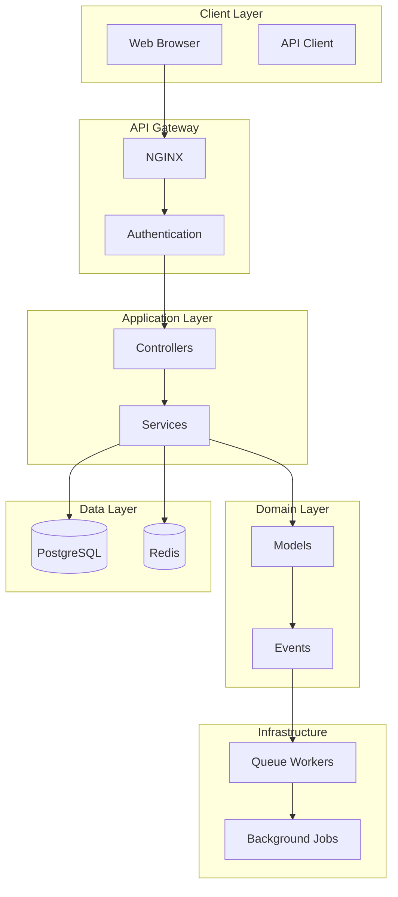

# DocFlow - Complete Project Planning Document

> **Production-Grade Document Approval System**
>
> Planning completed: January 30, 2025
>
> Status: Ready for Implementation

---

## Table of Contents

1. [Phase 0: Product Thinking](#phase-0-product-thinking)
2. [Phase 1: System Architecture](#phase-1-system-architecture)
3. [Phase 2: Data Engineering](#phase-2-data-engineering)
4. [Phase 3: Backend Core](#phase-3-backend-core)
5. [Phase 4: Async & Events](#phase-4-async--events)
6. [Phase 5: Caching & Performance](#phase-5-caching--performance)
7. [Phase 6: Observability](#phase-6-observability)
8. [Phase 7: Productization](#phase-7-productization)
9. [Phase 8: Portfolio Packaging](#phase-8-portfolio-packaging)
10. [Implementation Roadmap](#implementation-roadmap)

---

# Phase 0: Product Thinking

## Problem Statement

**Current State:**
Perusahaan masih approve dokumen via email/WhatsApp. Chaotic, no audit trail, sering bottleneck di approver tertentu, susah tracking status.

**Our Solution:**
Digital workflow engine yang route dokumen ke approval chain, track status real-time, enforce policy, complete audit trail.

## Business Impact

- ⏱️ Approval time: dari 3-5 hari → 4-6 jam (70% improvement)
- 📊 Visibility: dari "email ke siapa ya?" → dashboard real-time
- 🔒 Compliance: audit trail otomatis (ISO/SOC2 requirement)
- 💰 Cost: reduce admin overhead ~40%

## Use Cases

### 1. Leave Request (Cuti)

- Sequential approval: Direct Manager → Department Head
- Rules: max days per request, quota checking
- Auto-reject kalau quota habis

### 2. Reimbursement Claim

- Parallel + Sequential: Finance Checker (verify receipt) → Manager (approve budget)
- Rules: amount threshold (>$500 perlu Director approval)
- Attachment required (receipt image/PDF)

### 3. Purchase Request (PR)

- Complex chain: Requester → Manager → Procurement → Finance → Director (if >$5000)
- Conditional routing: amount-based escalation
- Delegation: approver bisa delegate ke backup

## Core Workflows

```
[Submit] → [Pending] → [In Review] → [Approved/Rejected] → [Completed]
                ↓
           [Returned] (minta revisi)
                ↓
           [Resubmit]
```

## System Boundaries

### IN SCOPE (MVP)

✅ Document submission dengan form dynamic
✅ Multi-step approval chains (sequential & parallel)
✅ Delegation mechanism
✅ State machine enforcement
✅ Audit trail
✅ Notification hooks
✅ Dashboard: my submissions, my approvals, team overview
✅ Policy engine: amount threshold, quota checking
✅ Attachment handling

### OUT SCOPE (V2)

❌ Integration ke HR/Finance system
❌ Mobile app
❌ Advanced reporting/BI
❌ E-signature integration

## Data Ownership & Trust Boundaries

- **Submitter:** bisa edit document hanya saat Draft/Returned
- **Approver:** bisa approve hanya step yang assigned + status pending
- **Admin:** bisa view semua, config template, tapi tidak bisa approve
- **Audit log:** immutable (append-only)

## Critical Business Rules

### Rule 1: Sequential Approval

Step N hanya bisa diakses kalau Step N-1 sudah approved.

### Rule 2: Parallel Approval

Semua parallel step di level yang sama harus approved baru lanjut.

### Rule 3: Conditional Routing

```
IF amount > $5000
  THEN add extra step: Director approval
ELSE
  skip Director
```

### Rule 4: Delegation

Delegation punya start/end date, auto-expire.

### Rule 5: Quota Enforcement

```
User punya annual leave quota: 12 days
Sudah pakai: 8 days
Request: 5 days
  ↓
System: AUTO-REJECT (insufficient quota)
```

---

# Phase 1: System Architecture

## Architecture Style

**Layered Architecture + Domain-Driven Design (DDD Lite)**

```
┌─────────────────────────────────────────┐
│   Presentation Layer (HTTP/API)         │  ← Controllers, Requests, Resources
├─────────────────────────────────────────┤
│   Application Layer (Use Cases)         │  ← Services, DTOs, Workflows
├─────────────────────────────────────────┤
│   Domain Layer (Business Logic)         │  ← Models, Policies, Rules, Events
├─────────────────────────────────────────┤
│   Infrastructure Layer (Tech Detail)    │  ← Repositories, Jobs, Notifications
└─────────────────────────────────────────┘
```

**Dependency Rule:**

- Outer layer boleh depend on inner layer
- Inner layer TIDAK BOLEH tahu outer layer
- Domain layer = pure business logic

## Layer Responsibilities

### Presentation Layer

**Tanggung jawab:**

- Terima HTTP request
- Validasi input (FormRequest)
- Panggil Application Service
- Transform response (API Resource)

**TIDAK boleh:**

- Business logic
- Database query langsung
- Calculation

### Application Layer (Services)

**Tanggung jawab:**

- Orchestrate use case flow
- Coordinate multiple domain objects
- Handle transactions
- Trigger side effects

**Core Services:**

```
DocumentService
  ├── submit()
  ├── update()
  ├── cancel()
  └── getMyDocuments()

ApprovalService
  ├── approve()
  ├── reject()
  ├── return()
  └── delegate()

PolicyService
  ├── checkQuota()
  ├── checkThreshold()
  └── shouldEscalate()

NotificationService
  ├── notifyApprovers()
  ├── notifySubmitter()
  └── notifyDelegated()
```

### Domain Layer (Models)

**Tanggung jawab:**

- Business rules enforcement
- State validation
- Domain events
- Entity relationships

**Key Models:**

```
User
Document
ApprovalStep
DocumentType
Policy
```

### Infrastructure Layer

**Tanggung jawab:**

- Queue jobs
- Email/SMS sending
- File storage
- External API integration

## Folder Structure

```
app/
├── Http/
│   ├── Controllers/
│   ├── Requests/
│   └── Resources/
├── Services/              ← Application Layer
├── Models/                ← Domain Layer
├── Enums/
├── Events/
├── Listeners/
├── Jobs/                  ← Infrastructure Layer
├── Notifications/
└── Policies/
```

## State Machine Design

### Document Status Flow

```
[DRAFT] ──submit──→ [PENDING] ──approve_all──→ [APPROVED] ──complete──→ [COMPLETED]
   ↑                    │            │
   │                    │            ├──reject──→ [REJECTED]
   │                    │            │
   └────return──────────┘            │
                                     │
                        cancel───────┘
```

### Approval Step Status

```
[PENDING] ──approve──→ [APPROVED]
   │
   ├──reject──→ [REJECTED]
   │
   └──return──→ [RETURNED]
```

---

# Phase 2: Data Engineering

## Database Schema Overview

**Total Tables:** 11
**Normalization:** 3NF
**Indexes:** 25+ (strategic)

## Core Tables

### 1. users

```sql
CREATE TABLE users (
    id BIGSERIAL PRIMARY KEY,
    email VARCHAR(255) NOT NULL UNIQUE,
    password VARCHAR(255) NOT NULL,
    name VARCHAR(255) NOT NULL,
    employee_id VARCHAR(50) UNIQUE,
    department_id BIGINT NOT NULL REFERENCES departments(id),
    role_id BIGINT NOT NULL REFERENCES roles(id),
    reports_to BIGINT REFERENCES users(id),
    is_active BOOLEAN DEFAULT true,
    created_at TIMESTAMP NOT NULL DEFAULT CURRENT_TIMESTAMP,
    updated_at TIMESTAMP NOT NULL DEFAULT CURRENT_TIMESTAMP,
    deleted_at TIMESTAMP
);

CREATE INDEX idx_users_department ON users(department_id) WHERE deleted_at IS NULL;
CREATE INDEX idx_users_reports_to ON users(reports_to) WHERE deleted_at IS NULL;
```

### 2. departments

```sql
CREATE TABLE departments (
    id BIGSERIAL PRIMARY KEY,
    name VARCHAR(255) NOT NULL UNIQUE,
    code VARCHAR(50) NOT NULL UNIQUE,
    created_at TIMESTAMP NOT NULL DEFAULT CURRENT_TIMESTAMP,
    updated_at TIMESTAMP NOT NULL DEFAULT CURRENT_TIMESTAMP
);
```

### 3. roles

```sql
CREATE TABLE roles (
    id BIGSERIAL PRIMARY KEY,
    name VARCHAR(100) NOT NULL UNIQUE,
    slug VARCHAR(100) NOT NULL UNIQUE,
    permissions JSONB,
    created_at TIMESTAMP NOT NULL DEFAULT CURRENT_TIMESTAMP,
    updated_at TIMESTAMP NOT NULL DEFAULT CURRENT_TIMESTAMP
);
```

### 4. document_types

```sql
CREATE TABLE document_types (
    id BIGSERIAL PRIMARY KEY,
    name VARCHAR(255) NOT NULL UNIQUE,
    slug VARCHAR(100) NOT NULL UNIQUE,
    description TEXT,
    form_schema JSONB NOT NULL,
    requires_attachment BOOLEAN DEFAULT false,
    max_attachments INTEGER DEFAULT 5,
    is_active BOOLEAN DEFAULT true,
    created_at TIMESTAMP NOT NULL DEFAULT CURRENT_TIMESTAMP,
    updated_at TIMESTAMP NOT NULL DEFAULT CURRENT_TIMESTAMP
);
```

### 5. documents (CRITICAL)

```sql
CREATE TABLE documents (
    id BIGSERIAL PRIMARY KEY,
    document_number VARCHAR(100) NOT NULL UNIQUE,
    document_type_id BIGINT NOT NULL REFERENCES document_types(id),
    submitter_id BIGINT NOT NULL REFERENCES users(id),
    title VARCHAR(500) NOT NULL,
    data JSONB NOT NULL,
    status VARCHAR(50) NOT NULL DEFAULT 'draft',
    submitted_at TIMESTAMP,
    completed_at TIMESTAMP,
    created_at TIMESTAMP NOT NULL DEFAULT CURRENT_TIMESTAMP,
    updated_at TIMESTAMP NOT NULL DEFAULT CURRENT_TIMESTAMP,
    deleted_at TIMESTAMP,
    CONSTRAINT chk_status CHECK (status IN (
        'draft', 'pending', 'approved', 'rejected',
        'returned', 'cancelled', 'completed'
    ))
);

CREATE INDEX idx_documents_submitter ON documents(submitter_id) WHERE deleted_at IS NULL;
CREATE INDEX idx_documents_status ON documents(status) WHERE deleted_at IS NULL;
CREATE INDEX idx_documents_type ON documents(document_type_id) WHERE deleted_at IS NULL;
CREATE INDEX idx_documents_submitted_at ON documents(submitted_at DESC) WHERE deleted_at IS NULL;
CREATE INDEX idx_documents_submitter_status ON documents(submitter_id, status)
    WHERE deleted_at IS NULL AND status = 'pending';
CREATE INDEX idx_documents_data_gin ON documents USING GIN (data);
```

### 6. approval_templates

```sql
CREATE TABLE approval_templates (
    id BIGSERIAL PRIMARY KEY,
    document_type_id BIGINT NOT NULL REFERENCES document_types(id),
    name VARCHAR(255) NOT NULL,
    description TEXT,
    condition_rules JSONB,
    is_default BOOLEAN DEFAULT false,
    is_active BOOLEAN DEFAULT true,
    created_at TIMESTAMP NOT NULL DEFAULT CURRENT_TIMESTAMP,
    updated_at TIMESTAMP NOT NULL DEFAULT CURRENT_TIMESTAMP,
    CONSTRAINT uq_default_template UNIQUE (document_type_id, is_default)
        WHERE is_default = true
);
```

### 7. approval_template_steps

```sql
CREATE TABLE approval_template_steps (
    id BIGSERIAL PRIMARY KEY,
    approval_template_id BIGINT NOT NULL REFERENCES approval_templates(id) ON DELETE CASCADE,
    sequence INTEGER NOT NULL,
    step_name VARCHAR(255) NOT NULL,
    approver_type VARCHAR(50) NOT NULL,
    approver_role_id BIGINT REFERENCES roles(id),
    approver_user_id BIGINT REFERENCES users(id),
    is_parallel BOOLEAN DEFAULT false,
    sla_hours INTEGER,
    created_at TIMESTAMP NOT NULL DEFAULT CURRENT_TIMESTAMP,
    updated_at TIMESTAMP NOT NULL DEFAULT CURRENT_TIMESTAMP,
    CONSTRAINT chk_approver_type CHECK (approver_type IN ('role', 'specific_user', 'dynamic')),
    CONSTRAINT uq_template_sequence UNIQUE (approval_template_id, sequence)
);
```

### 8. approval_steps

```sql
CREATE TABLE approval_steps (
    id BIGSERIAL PRIMARY KEY,
    document_id BIGINT NOT NULL REFERENCES documents(id) ON DELETE CASCADE,
    template_step_id BIGINT REFERENCES approval_template_steps(id),
    sequence INTEGER NOT NULL,
    step_name VARCHAR(255) NOT NULL,
    approver_id BIGINT NOT NULL REFERENCES users(id),
    delegated_from_id BIGINT REFERENCES users(id),
    delegation_start_date DATE,
    delegation_end_date DATE,
    status VARCHAR(50) NOT NULL DEFAULT 'pending',
    action_taken_at TIMESTAMP,
    action_taken_by BIGINT REFERENCES users(id),
    comments TEXT,
    sla_hours INTEGER,
    due_at TIMESTAMP,
    created_at TIMESTAMP NOT NULL DEFAULT CURRENT_TIMESTAMP,
    updated_at TIMESTAMP NOT NULL DEFAULT CURRENT_TIMESTAMP,
    CONSTRAINT chk_approval_status CHECK (status IN (
        'pending', 'approved', 'rejected', 'returned', 'skipped'
    ))
);

CREATE INDEX idx_approval_steps_document ON approval_steps(document_id);
CREATE INDEX idx_approval_steps_approver ON approval_steps(approver_id, status)
    WHERE status = 'pending';
CREATE INDEX idx_approval_steps_due_at ON approval_steps(due_at)
    WHERE status = 'pending' AND due_at IS NOT NULL;
```

### 9. policies

```sql
CREATE TABLE policies (
    id BIGSERIAL PRIMARY KEY,
    name VARCHAR(255) NOT NULL,
    policy_type VARCHAR(50) NOT NULL,
    document_type_id BIGINT REFERENCES document_types(id),
    department_id BIGINT REFERENCES departments(id),
    role_id BIGINT REFERENCES roles(id),
    rules JSONB NOT NULL,
    is_active BOOLEAN DEFAULT true,
    priority INTEGER DEFAULT 0,
    created_at TIMESTAMP NOT NULL DEFAULT CURRENT_TIMESTAMP,
    updated_at TIMESTAMP NOT NULL DEFAULT CURRENT_TIMESTAMP,
    CONSTRAINT chk_policy_type CHECK (policy_type IN (
        'quota_limit', 'amount_threshold', 'time_based', 'custom'
    ))
);

CREATE INDEX idx_policies_document_type ON policies(document_type_id) WHERE is_active = true;
CREATE INDEX idx_policies_priority ON policies(priority DESC) WHERE is_active = true;
```

### 10. attachments

```sql
CREATE TABLE attachments (
    id BIGSERIAL PRIMARY KEY,
    document_id BIGINT NOT NULL REFERENCES documents(id) ON DELETE CASCADE,
    filename VARCHAR(255) NOT NULL,
    original_filename VARCHAR(255) NOT NULL,
    file_path VARCHAR(500) NOT NULL,
    mime_type VARCHAR(100) NOT NULL,
    file_size BIGINT NOT NULL,
    uploaded_by BIGINT NOT NULL REFERENCES users(id),
    created_at TIMESTAMP NOT NULL DEFAULT CURRENT_TIMESTAMP,
    CONSTRAINT chk_file_size CHECK (file_size > 0 AND file_size <= 10485760)
);

CREATE INDEX idx_attachments_document ON attachments(document_id);
```

### 11. audit_logs (IMMUTABLE)

```sql
CREATE TABLE audit_logs (
    id BIGSERIAL PRIMARY KEY,
    user_id BIGINT REFERENCES users(id),
    user_name VARCHAR(255),
    user_email VARCHAR(255),
    action VARCHAR(100) NOT NULL,
    entity_type VARCHAR(100) NOT NULL,
    entity_id BIGINT NOT NULL,
    old_values JSONB,
    new_values JSONB,
    metadata JSONB,
    created_at TIMESTAMP NOT NULL DEFAULT CURRENT_TIMESTAMP,
    CONSTRAINT chk_entity_type CHECK (entity_type IN (
        'Document', 'ApprovalStep', 'User', 'Policy'
    ))
);

CREATE INDEX idx_audit_logs_entity ON audit_logs(entity_type, entity_id);
CREATE INDEX idx_audit_logs_user ON audit_logs(user_id);
CREATE INDEX idx_audit_logs_action ON audit_logs(action);
CREATE INDEX idx_audit_logs_created_at ON audit_logs(created_at DESC);
```

## Indexing Strategy

### Index Types

- **B-tree (default):** Foreign keys, timestamp columns
- **Partial:** Filtered indexes untuk active records
- **GIN:** JSONB columns
- **Composite:** Multi-column queries

### Critical Indexes

```sql
-- "My pending approvals" query
idx_approval_steps_approver(approver_id, status) WHERE status = 'pending'

-- "My pending documents" query
idx_documents_submitter_status(submitter_id, status) WHERE status = 'pending'

-- Document search by type + date
idx_documents_type_submitted(document_type_id, submitted_at DESC)

-- JSONB query optimization
idx_documents_data_gin USING GIN(data)
```

## Soft Delete Strategy

**Tables WITH soft delete:**

- users (compliance)
- documents (restore-able)

**Tables WITHOUT soft delete:**

- audit_logs (immutable)
- approval_steps (cascade from documents)
- Master tables (rarely deleted)

---

# Phase 3: Backend Core

## Authentication System

**Technology:** Laravel Sanctum (token-based)

### Key Components

1. **Login:** Generate API token
2. **Logout:** Revoke current token
3. **Me:** Get current user data

### Token Management

```php
// Generate token
$token = $user->createToken('api-token')->plainTextToken;

// Revoke token
$request->user()->currentAccessToken()->delete();
```

## RBAC (Role-Based Access Control)

### Roles

```
1. Staff
   - Submit document
   - View own documents
   - Cancel own pending documents

2. Manager
   - All Staff permissions
   - Approve documents (assigned)
   - View team documents

3. Finance
   - Approve reimbursement/PR
   - View financial documents

4. Admin
   - Config document types
   - Config templates
   - View all documents
   - CANNOT approve (separation of duty)
```

### Permission Check

```php
$user->hasPermission('document.create')
$user->hasPermission('approval.approve')
```

## Authorization Policies

### DocumentPolicy

```php
view(User, Document)       → Owner, Manager, Approver, Admin
update(User, Document)     → Owner + (Draft|Returned status)
cancel(User, Document)     → Owner + Pending status
delete(User, Document)     → Owner + Draft status
```

### ApprovalPolicy

```php
approve(User, ApprovalStep)   → Approver + Pending status
delegate(User, ApprovalStep)  → Approver + Pending status
```

## API Endpoints

### Authentication

```
POST   /api/auth/login
POST   /api/auth/logout
GET    /api/auth/me
```

### Documents

```
GET    /api/documents              # List with filters
POST   /api/documents              # Create draft
GET    /api/documents/{id}         # Detail
PUT    /api/documents/{id}         # Update
DELETE /api/documents/{id}         # Soft delete
POST   /api/documents/{id}/submit  # Submit for approval
POST   /api/documents/{id}/cancel  # Cancel
```

### Approvals

```
GET    /api/approvals              # My pending approvals
POST   /api/approvals/{id}/approve
POST   /api/approvals/{id}/reject
POST   /api/approvals/{id}/return
POST   /api/approvals/{id}/delegate
```

### Dashboard

```
GET    /api/dashboard/stats
GET    /api/dashboard/my-documents
GET    /api/dashboard/my-approvals
GET    /api/dashboard/team-documents
```

## Request Validation

### FormRequest Classes

```php
StoreDocumentRequest
  - document_type_id: required|exists
  - title: required|string|max:500
  - data: required|array
  - attachments: sometimes|array|max:5

UpdateDocumentRequest
  - title: sometimes|string|max:500
  - data: sometimes|array

ApproveDocumentRequest
  - comments: nullable|string|max:1000
```

### Dynamic Form Validation

Validasi field document berdasarkan `form_schema` di document_type.

## Error Handling

### Custom Exceptions

```php
BusinessException
InvalidStateException
InsufficientQuotaException
UnauthorizedException
```

### HTTP Status Codes

```
200 OK
201 Created
401 Unauthorized
403 Forbidden
404 Not Found
422 Validation Failed
500 Internal Server Error
```

## API Response Format

### Success

```json
{
  "data": {
    "id": 1,
    "document_number": "LV-2025-0001",
    ...
  }
}
```

### Error

```json
{
    "message": "Validasi gagal",
    "errors": {
        "title": ["Judul dokumen harus diisi"]
    }
}
```

---

# Phase 4: Async & Events

## Domain Events

### Core Events

```
DocumentCreated
DocumentSubmitted
DocumentCancelled
DocumentCompleted
ApprovalStepCompleted
DocumentApproved
DocumentRejected
DocumentReturned
ApprovalDelegated
DelegationExpired
```

## Event-Listener Mapping

```php
DocumentSubmitted::class => [
    InitializeApprovalChain::class,    // sync
    NotifyApprovers::class,             // async
    LogDocumentActivity::class,         // sync
],

ApprovalStepCompleted::class => [
    AdvanceWorkflow::class,             // async
    LogDocumentActivity::class,         // sync
],

DocumentApproved::class => [
    NotifySubmitter::class,             // async
    UpdateDocumentStatus::class,        // sync
    LogDocumentActivity::class,         // sync
],
```

## Queue System

### Queue Structure

```
workflows          (priority: high)    → approval processing
notifications      (priority: default) → email, push
emails             (priority: default) → dedicated email
reports            (priority: low)     → analytics
```

### Worker Configuration

```bash
# High priority (2 workers)
php artisan queue:work redis --queue=workflows --tries=3

# Default priority (3 workers)
php artisan queue:work redis --queue=notifications,emails --tries=3

# Low priority (1 worker)
php artisan queue:work redis --queue=reports --tries=2
```

## Background Jobs

### Key Jobs

```php
ProcessApprovalNotification
  - tries: 3
  - timeout: 60s
  - backoff: [60, 300]

CalculateQuotaBalance
  - tries: 2
  - timeout: 120s

GenerateMonthlyReport
  - tries: 1
  - timeout: 600s
```

## Retry Logic

### Exponential Backoff

```php
public $backoff = [60, 300, 900]; // 1min, 5min, 15min
```

### Idempotency Pattern

```php
// Check if already executed
if (Cache::has("job_executed:{$signature}")) {
    return; // Skip
}

// Execute job
// ...

// Mark as executed
Cache::put("job_executed:{$signature}", true, now()->addDay());
```

## Failed Jobs (Dead-Letter Queue)

```sql
CREATE TABLE failed_jobs (
    id BIGSERIAL PRIMARY KEY,
    uuid VARCHAR(255) UNIQUE NOT NULL,
    connection TEXT NOT NULL,
    queue TEXT NOT NULL,
    payload JSONB NOT NULL,
    exception TEXT NOT NULL,
    failed_at TIMESTAMP NOT NULL DEFAULT CURRENT_TIMESTAMP
);
```

### Retry Failed Jobs

```bash
php artisan queue:retry all
php artisan queue:retry {id}
```

## Job Scheduling

```php
// Daily: Calculate quotas
$schedule->job(new RecalculateAllQuotas())
    ->daily()->at('01:00');

// Hourly: Check SLA breaches
$schedule->job(new CheckSLABreaches())
    ->hourly()->between('08:00', '18:00');

// Weekly: Generate reports
$schedule->job(new GenerateWeeklyReport())
    ->weeklyOn(1, '08:00');

// Every 10 minutes: Expire delegations
$schedule->call(function() {
    // Expire logic
})->everyTenMinutes();
```

---

# Phase 5: Caching & Performance

## Performance Goals

| Metric                  | Target |
| ----------------------- | ------ |
| API Response Time (P50) | <200ms |
| API Response Time (P95) | <500ms |
| Cache Hit Rate          | >80%   |
| Concurrent Users        | 200+   |
| DB Connections          | <50    |

## Three-Layer Caching

### Layer 1: Application Cache (24h TTL)

- Departments
- Roles
- DocumentTypes
- ApprovalTemplates
- Policies

### Layer 2: Query Result Cache (5-60min TTL)

- Dashboard statistics
- Document lists
- Expensive aggregations

### Layer 3: User Session Cache (15-60min TTL)

- User permissions
- Team members
- User-specific data

## Cache Keys Convention

```
master:departments
master:document_type:{id}
policies:type:{typeId}
dashboard:user:{userId}
quota:{userId}:{year}
permissions:user:{userId}
team:manager:{managerId}
```

## Cache Invalidation

### Event-Based Invalidation

```php
// When document submitted
Cache::forget("dashboard:user:{submitter_id}");
Cache::forget("quota:{submitter_id}:{year}");
Cache::tags(["user:{submitter_id}:documents"])->flush();
```

### Observer-Based Invalidation

```php
class DocumentObserver
{
    public function updated(Document $document) {
        Cache::forget("document:{$document->id}");
        Cache::tags(["user:{$document->submitter_id}"])->flush();
    }
}
```

### Tag-Based Invalidation

```php
// Cache with tags
Cache::tags(['user:123', 'documents'])->put('key', $value);

// Invalidate all user caches
Cache::tags(['user:123'])->flush();
```

## Query Optimization

### Eager Loading (Prevent N+1)

```php
// BAD: N+1 query
$documents = Document::all();
foreach ($documents as $doc) {
    echo $doc->submitter->name; // N queries
}

// GOOD: Eager loading
$documents = Document::with(['submitter:id,name'])->get();
```

### Select Only Needed Columns

```php
User::select('id', 'name', 'email', 'department_id')
    ->with('department:id,name')
    ->get();
```

### Chunk Large Datasets

```php
Document::chunk(500, function($documents) {
    foreach ($documents as $doc) {
        // Process
    }
});
```

## Database Connection Pooling

### PgBouncer Configuration

```ini
[pgbouncer]
pool_mode = transaction
max_client_conn = 500
default_pool_size = 20
reserve_pool_size = 5
```

**Benefit:** 200 workers → 20 DB connections

---

# Phase 6: Observability

## Structured Logging

### Log Format (JSON)

```json
{
    "timestamp": "2025-01-30T10:15:23Z",
    "level": "info",
    "event": "document.submitted",
    "user_id": 123,
    "document_id": 456,
    "document_number": "LV-2025-0001",
    "context": {
        "request_id": "req_abc123",
        "ip": "192.168.1.100"
    }
}
```

### Log Levels

```
DEBUG    → Development only
INFO     → Normal operations
WARNING  → Potential issues (SLA breach)
ERROR    → Errors need attention
CRITICAL → System failures
```

## Request Correlation

### Request ID Middleware

```php
// Generate unique ID per request
$requestId = 'req_' . Str::random(12);

// Add to log context
Log::withContext([
    'request_id' => $requestId,
    'user_id' => auth()->id(),
]);

// Add to response header
$response->headers->set('X-Request-ID', $requestId);
```

## Business Metrics

### Key Metrics

```
documents_submitted_total (counter)
documents_approved_total (counter)
documents_pending_count (gauge)
document_approval_duration_seconds (histogram)
approvals_pending_count (gauge)
approval_sla_breaches_total (counter)
api_response_time_seconds (histogram)
cache_hit_rate (gauge)
```

### Metrics Storage (Redis)

```php
// Increment counter
Redis::incrby('metrics:documents_submitted_total', 1);

// Set gauge
Redis::set('metrics:documents_pending_count', $count);

// Record histogram (sorted set)
Redis::zadd('metrics:api_response_time', $duration, microtime(true));
```

## Health Check Endpoints

```
/health/live    → App alive? (200 OK)
/health/ready   → App ready to serve? (200/503)
/health/deep    → All dependencies OK? (200/503)
```

### Health Checks

```php
checkDatabase()         → DB connection
checkDatabaseWrite()    → DB write capability
checkRedis()            → Redis connection
checkRedisWrite()       → Redis write
checkQueue()            → Queue connectivity
checkQueueWorkers()     → Workers active?
checkDiskSpace()        → Disk <90% full
checkMemory()           → Memory <80% limit
```

## Monitoring Dashboard (Conceptual)

### Dashboard Sections

```
1. System Health
   - API Status, DB Status, Redis Status
   - Queue Workers, Cache Hit Rate

2. API Performance
   - Response Time P50, P95
   - Error Rate, Requests/min

3. Business Metrics
   - Documents submitted/approved/rejected
   - Pending approvals, SLA breaches

4. Queue Status
   - Pending jobs per queue
   - Failed jobs count

5. Slow Queries
   - Top queries >200ms
```

## Alerting Strategy

### Alert Levels

```
INFO     → Awareness
WARNING  → Attention needed
ERROR    → Action required
CRITICAL → Immediate action
```

### Alert Rules

```
P95 > 1000ms      → CRITICAL
P95 > 500ms       → WARNING
Queue > 1000 jobs → ERROR
Failed jobs > 50  → ERROR
SLA breaches > 10 → WARNING
```

---

# Phase 7: Productization

## Configuration Management

### config/docflow.php

```php
return [
    'document' => [
        'max_attachments' => env('DOCUMENT_MAX_ATTACHMENTS', 5),
        'max_file_size' => env('DOCUMENT_MAX_FILE_SIZE', 10485760),
        'auto_cancel_after_days' => env('DOCUMENT_AUTO_CANCEL_DAYS', 30),
    ],

    'approval' => [
        'default_sla_hours' => env('APPROVAL_DEFAULT_SLA_HOURS', 24),
        'reminder_after_hours' => env('APPROVAL_REMINDER_HOURS', 12),
        'allow_delegation' => env('APPROVAL_ALLOW_DELEGATION', true),
    ],

    'quota' => [
        'annual_leave_days' => env('QUOTA_ANNUAL_LEAVE_DAYS', 12),
        'min_notice_days' => env('QUOTA_MIN_NOTICE_DAYS', 3),
    ],

    'features' => [
        'approval_delegation' => env('FEATURE_APPROVAL_DELEGATION', true),
        'document_comments' => env('FEATURE_DOCUMENT_COMMENTS', false),
        'advanced_reporting' => env('FEATURE_ADVANCED_REPORTING', false),
    ],
];
```

## Feature Flags

### Feature Flag Table

```sql
CREATE TABLE feature_flags (
    id BIGSERIAL PRIMARY KEY,
    name VARCHAR(100) NOT NULL UNIQUE,
    is_enabled BOOLEAN DEFAULT true,
    rollout_percentage INTEGER DEFAULT 100,
    description TEXT,
    created_at TIMESTAMP NOT NULL DEFAULT CURRENT_TIMESTAMP,
    updated_at TIMESTAMP NOT NULL DEFAULT CURRENT_TIMESTAMP
);
```

### Feature Flag Service

```php
// Check if enabled
$featureFlags->isEnabled('document_templates', $user);

// Enable/disable
$featureFlags->enable('document_templates');
$featureFlags->disable('document_templates');

// Gradual rollout (0-100%)
$featureFlags->setRollout('document_templates', 50); // 50% users
```

## API Versioning

### URL-Based Versioning

```
/api/v1/documents
/api/v2/documents
```

### Version Controllers

```
app/Http/Controllers/V1/DocumentController.php
app/Http/Controllers/V2/DocumentController.php
```

### Deprecation Strategy

```php
'deprecated_versions' => [
    'v1' => [
        'deprecated_at' => '2025-06-01',
        'sunset_at' => '2025-12-01',
    ],
],
```

## Database Migration Strategy

### Safe Migrations (Zero Downtime)

```
✅ ADD column (nullable or with default)
✅ ADD index (CONCURRENTLY)
✅ CREATE table

❌ DROP column
❌ RENAME column
❌ CHANGE column type
```

### Multi-Step Migration Example

```
Step 1: ADD new column (nullable)
Step 2: Backfill data
Step 3: Update code to use new column
Step 4: Make column NOT NULL
Step 5: DROP old column (after monitoring)
```

## Environment Management

### Environment Hierarchy

```
local       → Development, debug on
staging     → Pre-production, production-like
production  → Live system, debug off
```

### Environment Detection

```php
if ($this->app->environment('production')) {
    URL::forceScheme('https');
}

if ($this->app->environment('local')) {
    DB::listen(function($query) {
        Log::debug('Query', ['sql' => $query->sql]);
    });
}
```

## Deployment

### Pre-Deployment Checklist

```
✅ .env.production configured
✅ Migrations tested
✅ Seeders ready
✅ Cache config (Redis)
✅ Queue workers
✅ Cron jobs
✅ Monitoring
✅ SSL certificate
```

### Deployment Script

```bash
#!/bin/bash
# deploy.sh

git pull origin main
composer install --no-dev --optimize-autoloader
php artisan migrate --force
php artisan config:cache
php artisan route:cache
php artisan queue:restart
sudo systemctl reload php8.2-fpm
php artisan cache:warm
curl -f http://localhost/health/ready || exit 1
```

### Rollback Script

```bash
#!/bin/bash
# rollback.sh

git reset --hard HEAD~1
composer install --no-dev
php artisan config:cache
php artisan queue:restart
sudo systemctl reload php8.2-fpm
```

---

# Phase 8: Portfolio Packaging

## Demo Scenario

### Storyline

```
Company: PT Tech Indonesia
Users: 25 employees (5 departments)
Document Types: Leave, Reimbursement, PR

Demo Flow:
1. Staff submit leave request
2. Manager approve (step 1)
3. Dept Head approve (step 2 - final)
4. Staff receive notification
5. Admin view analytics
6. Performance demo (caching, concurrent requests)
```

## Seed Strategy

### Data Volume

```
Users: 25
Departments: 5
Roles: 4
Documents: 150 (last 3 months)
  - 90 approved
  - 40 pending
  - 15 rejected
Approval Steps: ~450
Audit Logs: ~600
```

### Realistic Data

- Employee names: diverse, international
- Email: name@techindo.com
- Employee ID: EMP0001-EMP0025
- Document reasons: realistic scenarios
- Approval times: realistic (2-8 hours)

## README Structure

### Sections

```markdown
1. Hero (logo, badges, links)
2. Why This Project? (problem/solution/impact)
3. Key Features (bullet points)
4. Performance Metrics (table)
5. Architecture (diagram)
6. Tech Stack
7. Screenshots (collapsible)
8. Quick Start (installation)
9. API Documentation (overview)
10. Testing
11. Project Structure
12. Configuration
13. Monitoring
14. Deployment
15. Author & Links
```

### Key Highlights (Badges)

```
[]
[]
[]
[]
```

## Architecture Diagram (Mermaid)



## Screenshots Checklist

```
✅ Dashboard overview
✅ Submit document form
✅ Document list (filtered)
✅ Approval pending view
✅ Approval detail + history
✅ Document approved state
✅ Audit trail
✅ Admin analytics dashboard
```

## Interview Script

### 30-Second Pitch

```
"Saya develop DocFlow, enterprise document approval system
dengan multi-step workflow automation.

Key challenge: bottleneck approval (3-5 hari) → solved dengan
automated routing (4-6 jam).

Technical: clean architecture, event-driven, multi-layer caching,
200+ concurrent users, P95 <500ms."
```

### Technical Q&A Prep

**Q: Architecture decisions?**
A: Layered architecture untuk separation of concerns, event-driven untuk decouple side effects...

**Q: Concurrency issues?**
A: Database optimistic locking, transaction isolation, queue idempotency, Redis atomic operations...

**Q: Performance optimization?**
A: Multi-layer caching (master/query/session), eager loading, partial indexes, PgBouncer...

**Q: Failure handling?**
A: Retry logic dengan exponential backoff, dead-letter queue, graceful degradation, health checks...

**Q: Data integrity?**
A: DB constraints (FK, CHECK, UNIQUE), FormRequest validation, Policy enforcement, append-only audit...

## GitHub Repository

### Structure

```
docflow/
├── .github/workflows/ci.yml
├── docs/
│   ├── images/
│   ├── API.md
│   ├── ARCHITECTURE.md
│   └── DEPLOYMENT.md
├── app/
├── database/
├── tests/
├── .env.example
├── README.md
├── LICENSE
└── CONTRIBUTING.md
```

### Important Files

```
.env.example     → Template config
.gitignore       → Exclude .env, vendor/, node_modules/
README.md        → Main documentation
LICENSE          → MIT License
CONTRIBUTING.md  → Contribution guide
```

## LinkedIn Post

```
🚀 Excited to share: DocFlow - Enterprise Document Approval System

I built a production-grade workflow automation that reduces
approval times by 70% (3-5 days → 4-6 hours).

🎯 Key Features:
• Multi-step approval workflow
• Policy enforcement
• Real-time notifications
• Complete audit trail

💡 Technical Highlights:
• Clean Architecture
• Event-Driven Design
• Multi-layer Caching (87% hit rate)
• 200+ concurrent users, P95 <500ms

Built with Laravel, PostgreSQL, Redis

Repo: [link]
Demo: [link]

#Laravel #PHP #SoftwareEngineering #BackendDevelopment
```

---

# Implementation Roadmap

## Phase-by-Phase Implementation Order

### Phase 1: Foundation (Week 1)

```
1. Setup Laravel project
2. Configure PostgreSQL + Redis
3. Create all migrations (11 tables)
4. Run migrations
5. Create Eloquent models dengan relationships
6. Write model unit tests
```

### Phase 2: Authentication & Authorization (Week 1)

```
7. Install Sanctum
8. Create Auth controllers (login/logout/me)
9. Create Role & Permission seeders
10. Create User seeder
11. Create Policies (DocumentPolicy, ApprovalPolicy)
12. Test authentication flow
```

### Phase 3: Core Features (Week 2)

```
13. Create DocumentService
14. Create ApprovalService
15. Create PolicyService
16. Create Controllers (Document, Approval)
17. Create FormRequests (validation)
18. Create API Resources (response format)
19. Test document submission flow
20. Test approval flow
```

### Phase 4: Events & Jobs (Week 2)

```
21. Create Domain Events
22. Create Event Listeners
23. Create Background Jobs
24. Configure Queue system
25. Test async processing
```

### Phase 5: Caching & Performance (Week 3)

```
26. Create CacheService
27. Implement cache invalidation
28. Add eager loading to queries
29. Create indexes (if not in migration)
30. Performance testing
```

### Phase 6: Observability (Week 3)

```
31. Create LoggerService
32. Create MetricsService
33. Create Health check endpoints
34. Add Request ID middleware
35. Test logging & monitoring
```

### Phase 7: Polish & Documentation (Week 4)

```
36. Write comprehensive tests (target 85%+)
37. Create realistic seeders
38. Write API documentation
39. Write README
40. Create architecture diagrams
41. Record demo video
42. Deploy to staging
```

## Testing Strategy

### Test Coverage Target: 85%+

```
Unit Tests (40%)
- Model methods
- Service business logic
- Policy authorization

Feature Tests (50%)
- API endpoints
- Authentication flow
- Document submission flow
- Approval workflow
- Error handling

Integration Tests (10%)
- Event-listener flow
- Queue processing
- Cache invalidation
```

### Test Examples

```php
// Unit test
test('document can be edited when draft')
test('approval step validates approver')

// Feature test
test('user can submit document')
test('manager can approve document')
test('user cannot approve own document')

// Integration test
test('document submission triggers approval chain')
test('approval completion advances workflow')
```

## CI/CD Pipeline

```yaml
# .github/workflows/ci.yml
- Run tests
- Check code style (Pint)
- Static analysis (PHPStan)
- Security scan
- Deploy to staging (on main branch)
```

## Deployment Strategy

### Staging Environment

```
1. Auto-deploy dari main branch
2. Real-like data (anonymized)
3. Full monitoring
4. Demo environment
```

### Production Environment

```
1. Manual deployment
2. Blue-green deployment (zero downtime)
3. Database migration before deploy
4. Rollback plan ready
5. Post-deployment verification
```

---

# Success Metrics

## Code Quality

```
✅ Test coverage: 85%+
✅ PHPStan level: 5+
✅ PSR-12 compliant
✅ No TODO/FIXME in main branch
```

## Performance

```
✅ P50 response time: <200ms
✅ P95 response time: <500ms
✅ Cache hit rate: >80%
✅ Database queries: <10 per request
```

## Documentation

```
✅ README complete
✅ API documented
✅ Architecture documented
✅ Inline comments for complex logic
```

## Portfolio Impact

```
✅ GitHub stars: target 50+
✅ LinkedIn engagement: 100+ reactions
✅ Interview callbacks: increased
✅ Technical discussion depth: confident
```

---

# Resources & References

## Laravel Documentation

- https://laravel.com/docs/11.x
- https://laravel.com/docs/11.x/eloquent
- https://laravel.com/docs/11.x/queues

## PostgreSQL

- https://www.postgresql.org/docs/15/
- https://www.postgresql.org/docs/15/indexes.html

## Design Patterns

- Clean Architecture (Robert C. Martin)
- Domain-Driven Design (Eric Evans)
- Enterprise Integration Patterns (Gregor Hohpe)

## Tools

- Postman (API testing)
- TablePlus (DB client)
- Redis Commander (Redis GUI)
- Laravel Telescope (debugging)

---

# Appendix

## Glossary

**Approval Chain:** Sequence of approval steps
**Approval Step:** Single approval action by one approver
**Document Type:** Template for document (Leave, Reimbursement)
**Policy:** Business rule (quota, threshold)
**Delegation:** Temporary approval authority transfer
**SLA:** Service Level Agreement (expected completion time)
**Audit Trail:** Immutable history of actions

## Acronyms

**RBAC:** Role-Based Access Control
**CQRS:** Command Query Responsibility Segregation
**DDD:** Domain-Driven Design
**ACID:** Atomicity, Consistency, Isolation, Durability
**TTL:** Time To Live
**P50/P95:** 50th/95th percentile
**GIN:** Generalized Inverted Index

---

**Document Status:** Complete
**Next Action:** Begin Implementation (Phase 1: Foundation)
**Contact:** Ready for coding phase

---

_This planning document is a living guide. Update as implementation progresses._
